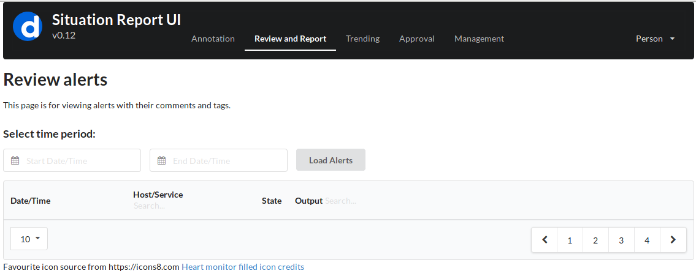

# Situation Report (SitRep)
A web application to help track Shinken alerts and administrator activities to resolve them.

## Project Status
This project is currently a work in progress.

## Insipration
This tool was greatly inspired by the Opsweekly by Etsy.
https://github.com/etsy/opsweekly

## Installation
The installation process is still very manual at this stage.

### Backend - database and server daemon

#### MySQL
Install MySQL server on the host that will be used to store Shinken logs.  Set up the database
schema.

#### SitRep daemon
Build the sitrep daemon and place it on the host that will be accessible by the frontend webapp.

#### Nginx - Reverse proxy and web server
Nginx is used as a reverse proxy to access the SitRep daemon's REST API.  It also servers the static
content for the web app.  The following library/frameworks need to be included in the webroot.

 - semantic.min.css
 - cal-heatmap.css
 - jquery-3.1.0.js
 - semantic.min.js
 - d3.v3.min.js
 - cal-heatmap.min.js

### Frontend - web application
The web application requires access to SitRep daemon REST API.

## Legal
Thanks to https://icons8.com for the use of their icon 

## License
The MIT License (MIT)

Copyright (c) 2016 Carlos (nzlosh@yahoo.com)

Permission is hereby granted, free of charge, to any person obtaining a copy of this software and
associated documentation files (the "Software"), to deal in the Software without restriction,
including without limitation the rights to use, copy, modify, merge, publish, distribute,
sublicense, and/or sell copies of the Software, and to permit persons to whom the Software is
furnished to do so, subject to the following conditions:

The above copyright notice and this permission notice shall be included in all copies or
substantial portions of the Software.

THE SOFTWARE IS PROVIDED "AS IS", WITHOUT WARRANTY OF ANY KIND, EXPRESS OR IMPLIED, INCLUDING BUT
NOT LIMITED TO THE WARRANTIES OF MERCHANTABILITY, FITNESS FOR A PARTICULAR PURPOSE AND
NONINFRINGEMENT. IN NO EVENT SHALL THE AUTHORS OR COPYRIGHT HOLDERS BE LIABLE FOR ANY CLAIM,
DAMAGES OR OTHER LIABILITY, WHETHER IN AN ACTION OF CONTRACT, TORT OR OTHERWISE, ARISING FROM, OUT
OF OR IN CONNECTION WITH THE SOFTWARE OR THE USE OR OTHER DEALINGS IN THE SOFTWARE.
